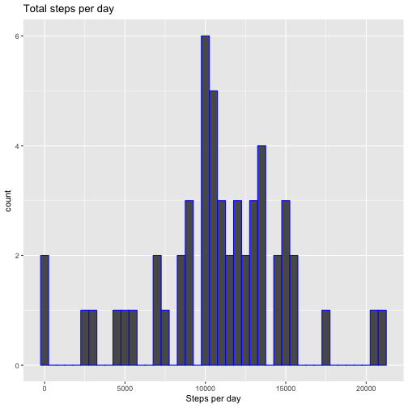
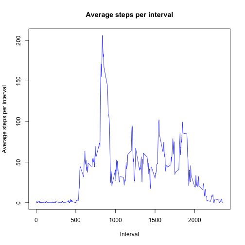
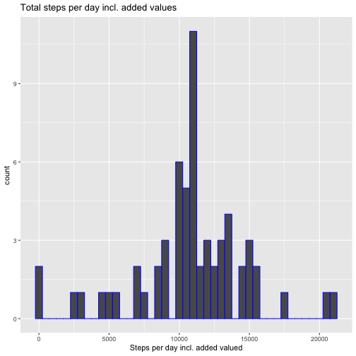
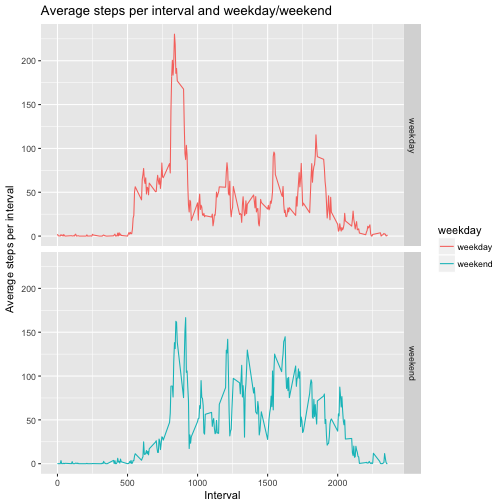

Peer-graded Assignment: Course Project 1
========================================

Import of the necessary libraries to the project


```r
library("dplyr")
library("ggplot2")
```

Read the provided data and change the format of the dates


```r
activity_data <- read.csv("./RepData_PeerAssessment1/activity.csv")
activity_data$date <- as.Date(as.character(activity_data$date), "%Y-%m-%d")
```

Group the activity data by date and sum the steps per day.
The result is printed in a histogram.


```r
total_day <- activity_data %>% group_by(date) %>% summarise(steps_per_day = sum(steps))

hist_steps <- ggplot(total_day, aes(steps_per_day)) + 
    geom_histogram(binwidth = 500, colour = 'blue', na.rm = TRUE) + 
    xlab("Steps per day") + 
    ggtitle("Total steps per day")
print(hist_steps)
```



The calculated mean and median of steps per days while ignoring the missing data


```r
summarise(total_day, mean = mean(total_day$steps_per_day, na.rm = TRUE), median = median(total_day$steps_per_day, na.rm = TRUE))
```

```
## # A tibble: 1 x 2
##     mean median
##    <dbl>  <int>
## 1 10766.  10765
```

Calculate the avarage numer of steps per interval and plotting it in a line diagram.


```r
avg_interval <- activity_data %>% group_by(interval) %>% summarise(avg_int = mean(steps, na.rm = TRUE))

plot(avg_interval$interval, avg_interval$avg_int, type="l", col = "blue", main = "Average steps per interval", xlab = "Interval", ylab = "Average steps per interval")
```



The caluclate the maximum of avarage steps per interval and define the interval


```r
max_interval <- filter(avg_interval, avg_int == max(avg_int))
max_interval
```

```
## # A tibble: 1 x 2
##   interval avg_int
##      <int>   <dbl>
## 1      835    206.
```

```r
##max_interval$interval
##max_interval$avg_int
```

The missing data ('NA') is substitued by the average of steps of the same interval. For this it's searched by the interval for the row number, than the avarage is transformed into a data frame and added to the original data.

After this the data is grouped by date and the sum of steps per day as base for the histogram.


```r
activity_data_added <- cbind(activity_data, data.frame(avg_interval[match(activity_data$interval, avg_interval$interval),2]))
activity_data_added <- mutate (activity_data_added, added = ifelse(is.na(steps), avg_int, steps))
activity_data_added <- select(activity_data_added, steps = added, date, interval)

total_day_added <- activity_data_added %>% group_by(date) %>% summarise(steps_per_day = sum(steps))

hist_steps_added <- ggplot(total_day_added, aes(steps_per_day)) + 
    geom_histogram(binwidth = 500, colour = 'blue', na.rm = TRUE) + 
    xlab("Steps per day incl. added valued") + 
    ggtitle("Total steps per day incl. added values")
print(hist_steps_added)
```



At first there's a list of all used weekdays of which we take only the days Monday till Friday.
After this we added a new variable to the data which indicated the weekday or weekend. 
Than the data is grouped by interval and weekday/weekdend to get the mean of steps and plot them in a line diagram.


```r
weekdays <- unique(weekdays(activity_data_added$date))[1:5]
weekdays_end <- activity_data_added %>% mutate(weekday = ifelse((weekdays(date) %in% weekdays),"weekday", "weekend"))

avg_interval_week <- weekdays_end %>% group_by(interval, weekday) %>% summarise(avg_int = mean(steps, na.rm = TRUE))

qplot(interval, avg_int, data = avg_interval_week, facets = weekday~., geom = "line", colour = weekday, main = "Average steps per interval and weekday/weekend", xlab = "Interval", ylab = "Average steps per interval")
```



